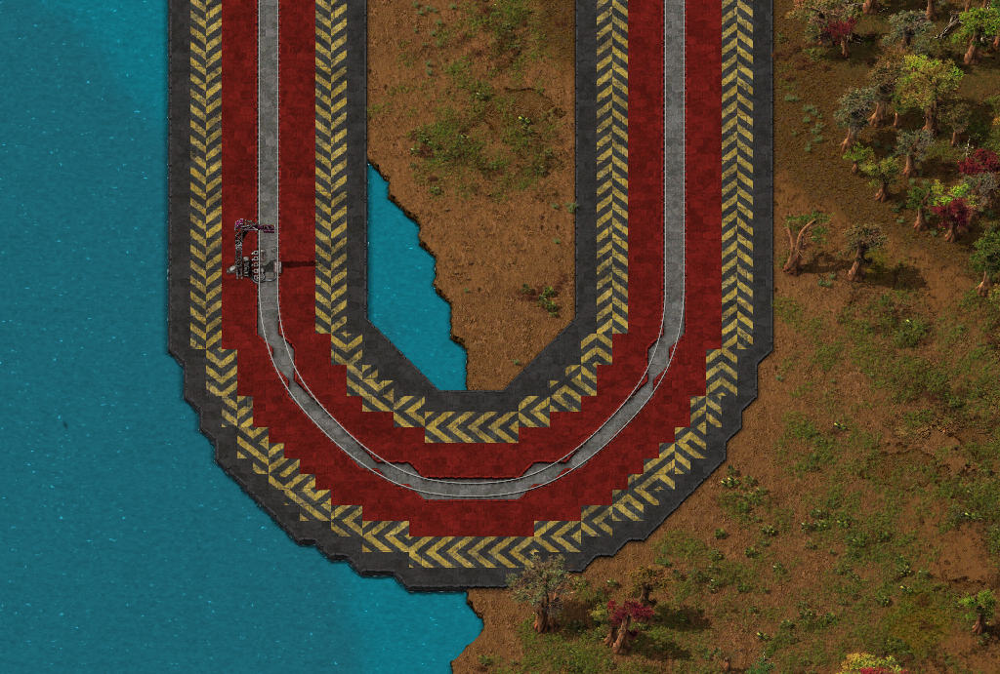

# RailBow Refracted # 

[GitHub](https://ww.github.com/R3CONN3R/RailBow-Refracted) | [Factorio Mod Portal](https://mods.factorio.com/mod/RailBow-Refracted)

Railbow Refracted is a fork/overhaul of the [Railbow mod](https://mods.factorio.com/mod/RailBow).

## Features:

- Selection tool with multiple modes:
  - Left-click to place tiles around rails on existing terrain
  - Shift left-click to apply landfill/foundation/ice platform before placing tiles
  - Right-click to remove tiles around rails in the range of the selected preset
  - Shift right-click to only remove trees/rocks cliffs in range 
- Set tiles for left/right side of travel direction, detected via rail signal
- Automatically removes trees/rocks and cliffs, configurable per profile
- Settings options to set defaults for landfill placement and obstacle removal
- Import/export/copy presets
- Hotkeys (configurable in controls):
  - N = put selection tool in cursor
  - Shift-N = open configuration window
- Limited undo/redo ~last 4000 tiles, depends on tiles per tick setting and your finger dexterity
- Mod Support:
  - Supports [Naked Rail mod](https://mods.factorio.com/mod/naked-rails-f2) rails
  - ? (open for requests)

